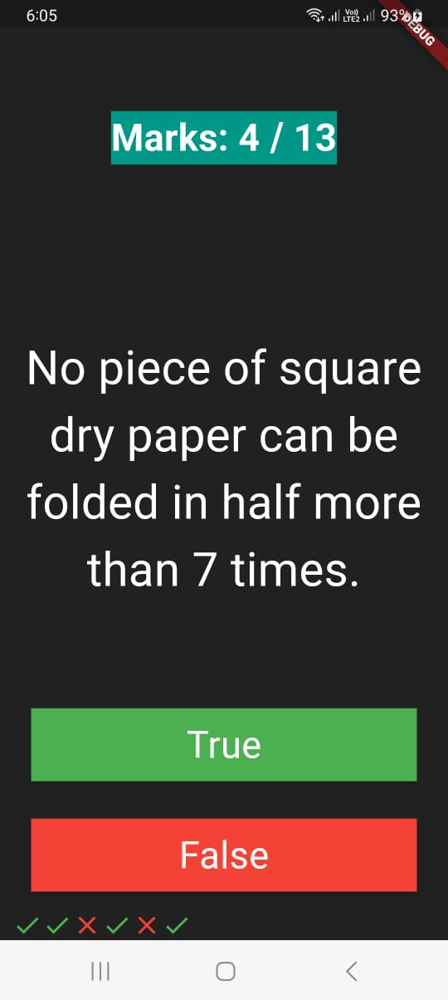
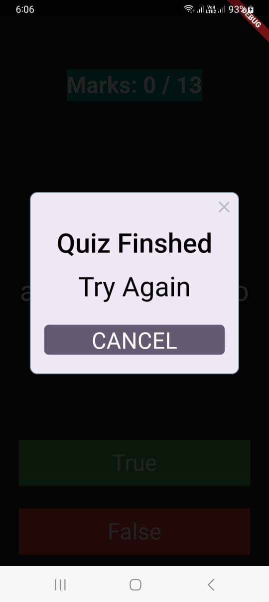

# FlutterSimpleQuizApp

Welcome to FlutterSimpleQuizApp!

This Flutter application is designed to create a simple quiz experience where users can answer questions, track their scores, identify correct and incorrect answers, and navigate through different questions.

## Features:

- **Quiz Interface**: Engaging user interface for answering questions.
- **Scoring System**: Tracks marks based on correct and incorrect answers.
- **Question Navigation**: Allows users to move through different questions.
- **Correct and Incorrect Indicators**: Clearly indicates correct and wrong answers.
- **Interactive Design**: Built using Flutter for a smooth and responsive experience.

## Getting Started:

1. **Clone the Repository**:
   ```
   git clone https://github.com/rasoolzada/FlutterSimpleQuizApp.git
   ```

2. **Navigate to the Project Directory**:
   ```
   cd FlutterSimpleQuizApp
   ```

3. **Run the Application**:
   Ensure you have Flutter set up and configured on your development environment. Then, run the app using:
   ```
   flutter run
   ```

4. **Explore and Customize**:
   Feel free to explore the codebase, modify the questions, UI, or add new features according to your requirements.

## Screenshots:





## Contributing:

Contributions are welcome! If you find any bugs or have suggestions for improvements, please open an issue or create a pull request.

## References
[Udemy](https://www.udemy.com/course/flutter-bootcamp-with-dart)